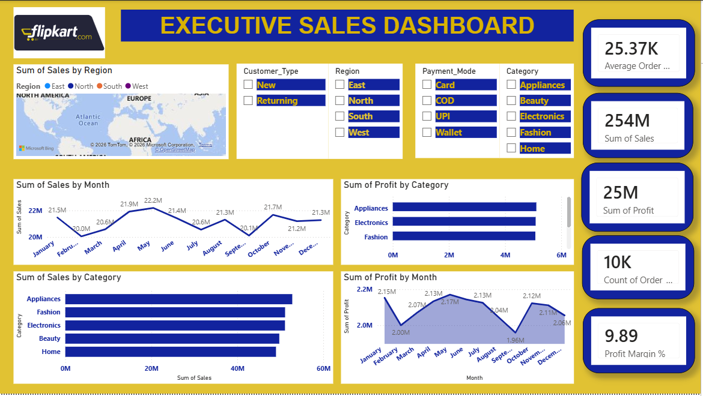
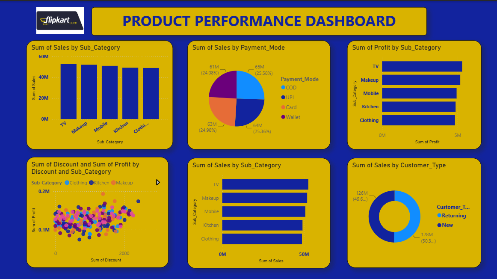
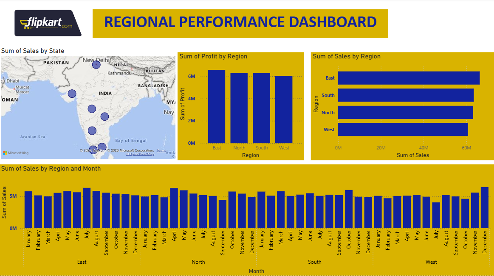

# Flipkart Business Intelligence Dashboards

## 1. Executive Sales Dashboard

### Key Focus
*   **Track Growth:** Analyzing GMV (Gross Merchandise Value), net revenue, and sales growth across different product categories.
*   **Core Metrics:** Total Orders, Average Order Value (AOV), Category Contribution %, and Return Rates.
*   **Insight Example:** Identifies which flagship sale events (like Big Billion Days) drive the highest customer acquisition and which product categories have the healthiest margins.

---

## 2. Product Performance Dashboard

### Key Focus
*   **Optimize Inventory:** Monitoring individual product SKU performance, stock levels, and category health.
*   **Core Metrics:** Inventory Turnover Ratio, Out-of-Stock (OOS) Rate, and Gross Margins by Product Line.
*   **Insight Example:** Pinpoints fast-moving items to ensure timely restocking while flagging stagnant inventory for promotional discounts.

---

## 3. Regional Performance Dashboard

### Key Focus
*   **Geographic Insights:** Understanding delivery timelines, sales distribution, and customer density across different states and zones.
*   **Core Metrics:** Order-to-Delivery Time, First-Mile/Last-Mile Costs, and Regional Sales Penetration.
*   **Insight Example:** Highlights specific regional logistics hubs experiencing delivery bottlenecks, allowing supply chain teams to reroute inventory.
